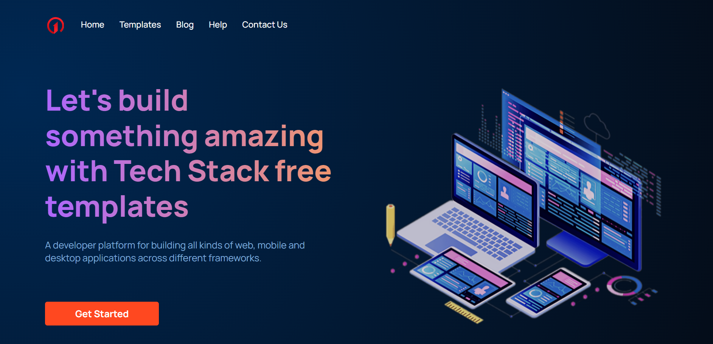

# Airbus Aerothon 4.0

# Tech Stack Web Application ([Visit](https://frondend.d3eo2hilmaxlla.amplifyapp.com/))

Tech Stack is a strong cross platform framework with modern architecture. A developer platform for building all kinds of web, mobile and desktop applications across different frameworks based on the requirement. It is a framework that help developers to kick-start their development with integrated back-end and frond-end templates. It is a fully responsive website.

## Active Pages
- Home Page
- Template Page

## Key Features
- It provides a fully customizable templates of your favourite front-end and back-end framework to start with. No need to install different libraries and dependencies, you can get here all in one.
- Be it professional or a beginner developer, no one likes a bad UI. We have made responsive, to the point user interface to interact with.
- Works on cross-platforms such as windows, macOS, Linux.

### Screenshot

 

### What I learned

In this challenge I learned about 

- React Components
- `useState` hooks
- Redux
- Applying Firebase authentication
- Dynamic page rendering
- Applying payment functionality using stripe
- Connecting backend with realtime database
